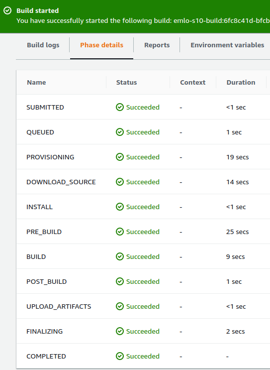
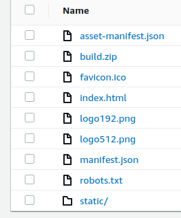
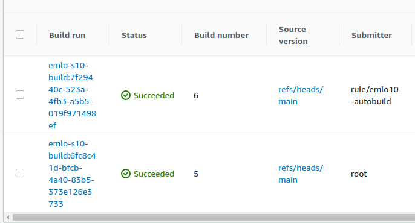
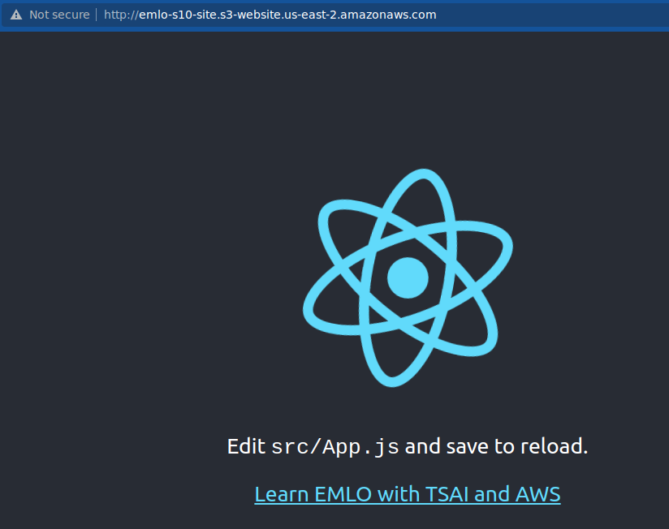
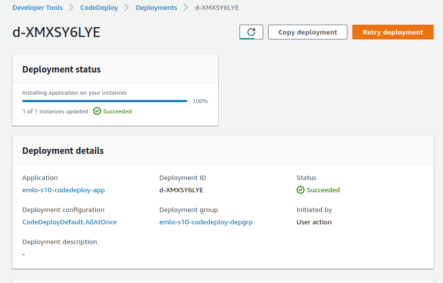
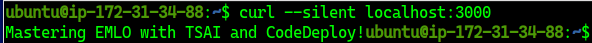

# EMLO Session 10

The objective of this session was to implement CI/CD on AWS using CodeCommit, CodeBuild, and CodeDeploy.


# Task 1

We are required to add an artifact. 

The following lines were added to `buildspec.yml`

```
artifacts:
  type: zip
  paths:
    - './build/**/*'
```

After the build successfully completes,  we can see the log



We can also see our artifact created.




Auto-build using cloudwatch also works fine




We can also see the result of our site



# Task 2
We are required to change the code and implement CodeDeploy. This has been done successfully.




Running the curl command gives the following results.


